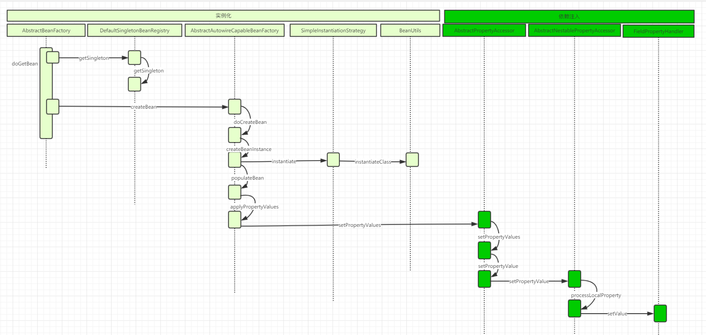

# Spring DI

## 结构解析

**实例化**

+ `org.springframework.beans.factory.support.AbstractBeanFactory#doGetBean()`   beanFactory的实现类，包含了一些通用的逻辑->
  + `getSingleton`()  先从单例集合中获取
+ `org.springframework.beans.factory.support.DefaultSingletonBeanRegistry#getSingleton()` 获取单例对象->
  + 获取单例对象
+ `org.springframework.beans.factory.support.AbstractAutowireCapableBeanFactory`->
  + `createBean()` 创建对象 
  + `doCreateBean()` 具体创建对象
+ `org.springframework.beans.factory.support.AbstractAutowireCapableBeanFactory#doCreateBean()` 创建bean ->
  + `populateBean()` 用来属性注入的方法
+ `org.springframework.beans.factory.support.AbstractAutowireCapableBeanFactory#populateBean()`  ->
  + 获取根据name注入的属性 `autowireByName()`
  + 获取根据type注入的属性`autowireByType()`
+ `org.springframework.beans.factory.support.AbstractAutowireCapableBeanFactory#applyPropertyValues()` ->
  + 转换属性的类型
  + 进行依赖注入

+ `org.springframework.beans.BeanWrapper#setPropertyValues()` 调用BeanWrapper进行属性注入-> 

  >  这里 会发现在BeanWrapper中没有setPropertyValues(),因为在他的父类PropertyAccessor中，所以时序图是画在了父类

+ `org.springframework.beans.AbstractPropertyAccessor#setPropertyValues()`  设置属性 ->

+ `org.springframework.beans.AbstractNestablePropertyAccessor#setPropertyValue)` 设置属性->

+ `org.springframework.beans.AbstractNestablePropertyAccessor#setPropertyValue()` 设置属性->

  + 有token的情况
  + 没有token的情况

+ `org.springframework.beans.AbstractNestablePropertyAccessor#processLocalProperty`  设置属性->

+ `org.springframework.beans.DirectFieldAccessor.FieldPropertyHandler#setValue` 真正赋值的地方

