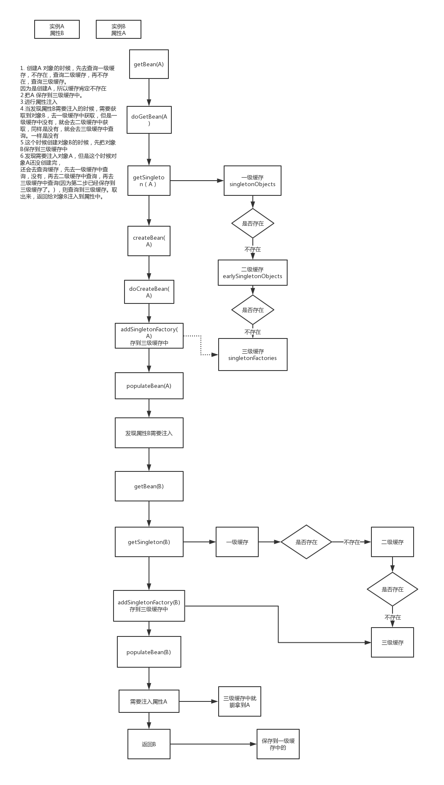

Spring DI 的属性互相依赖的问题？

~~~java
@Controller
public class A {
    @Autowired
    private B b;
}

@Service
public class B {
    @Autowired
    private A a;
}

~~~

当`A`->`B`    `B`->`A` ,这就是互相依赖。

直接看源码

`org.springframework.beans.factory.support.AbstractBeanFactory#getBean` 获取bean 

`org.springframework.beans.factory.support.AbstractBeanFactory#doGetBean`  真正获取bean的方法

`org.springframework.beans.factory.support.DefaultSingletonBeanRegistry#getSingleton` 从缓存中获取 

+ 从一级缓存`singletonObjects` 获取
  + 单例对象的cache
+ 不存在的话，从二级缓存`earlySingletonObjects` 获取
  + 提前曝光的单例对象集合
+ 不存在的话，从三级缓存`singletonFactories` 获取
  + 单例工厂的cache,也是用来处理循环依赖的集合
  + 如果在三级缓存中获取到了，并且保存到二级缓存中，从三级缓存中删除

`org.springframework.beans.factory.support.AbstractAutowireCapableBeanFactory#createBean` 创建bean

`org.springframework.beans.factory.support.AbstractAutowireCapableBeanFactory#doCreateBean` 真正创建bean

+ `addSingletonFactory` 把当前创建的bean保存到三级缓存中。 不提前暴露出来
+ `populateBean`  进行属性注入

`org.springframework.beans.factory.support.AbstractAutowireCapableBeanFactory#autowireByName` 根据name注入

+ 当发现有依赖bean则会调用`getBean`方法

关键点就在`populateBean`  属性注入这一块了

当发现当前创建的bean有依赖的话。用上面的A 和B 来说明这个例子

getBean来获取A的实例对象。

先通过`getSingleton`  去缓存中获获取

​	先从一级缓存`singletonObjects`中获取，当一级缓存没有的时候，从二级缓存`earlySingletonObjects`中获取，二级也没有的时候，从三级缓存`singletonFactories`中获取

如果缓存中都不存在话。

​	先创建A对象。并且调用`addSingletonFactory`方法保存到三级缓存中。

调用`populateBean`来进行属性注入

​	注入的时候，会发现需要注入B。 则会调用`getBean`方法

`getBean`来获取B的实例对象。

先通过`getSingleton`  去缓存中获获取

​	先从一级缓存`singletonObjects`中获取，当一级缓存没有的时候，从二级缓存`earlySingletonObjects`中获取，二级也没有的时候，从三级缓存`singletonFactories`中获取

如果缓存中都不存在话。

​	先创建B对象。并且调用`addSingletonFactory`方法保存到三级缓存中。

调用`populateBean`来进行属性注入

​	注入的时候，会发现需要注入A。 则会调用`getBean`方法

`getBean`来获取A的实例对象。

先通过`getSingleton`  去缓存中获获取

​	先从一级缓存`singletonObjects`中获取，当一级缓存没有的时候，从二级缓存`earlySingletonObjects`中获取，二级也没有的时候，从三级缓存`singletonFactories`中获取

​        这个时候肯定会从三级缓存中获取到A的实例对象。 把A存放到二级缓存中，并且从三级缓存中删除A

调用`populateBean` 进行属性注入

​	注入的时候，会发现需要注入B，则会调用`getBean`方法

`getBean`来获取B的实例对象。

先通过`getSingleton`  去缓存中获获取

​	先从一级缓存`singletonObjects`中获取，当一级缓存没有的时候，从二级缓存`earlySingletonObjects`中获取，二级也没有的时候，从三级缓存`singletonFactories`中获取

​        这个时候肯定会从三级缓存中获取到B的实例对象。 把B存放到二级缓存中，并且从三级缓存中删除B

返回B实例 并且保存到一级缓存中

返回A实例 并且保存到一级缓存中

​	

在构造函数中存在互相依赖

从上面的逻辑可以看到，优先创建对象，然后进行属性注入，但是构造函数中存在互相以来的话，就导致死循环了。

