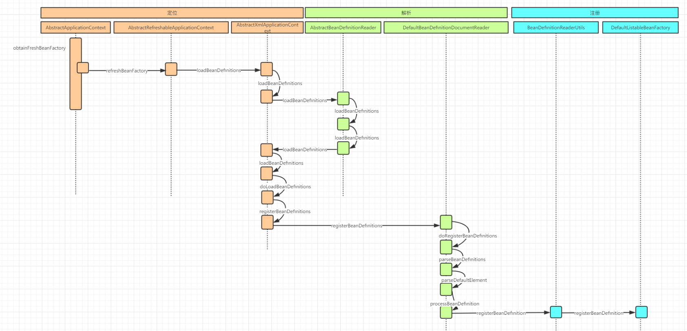
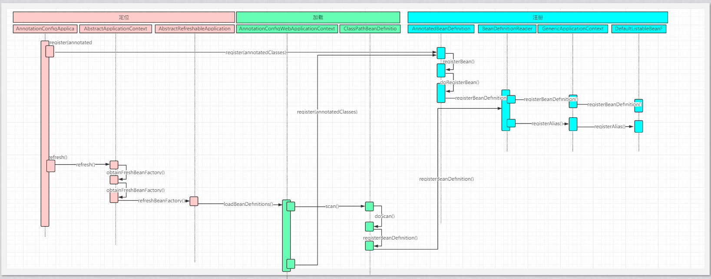

# Spring ioc

## 结构解析

首先我们访问`ClassPathXmlApplicationContext`构造函数

里面有个`refresh()` -> 父类`AbstractApplicationContext` 的`refresh()`方法

### 定位

> 这个时候开始进行定位步骤

+ `refresh()`-> 

+ `AbstractApplicationContext#obtainFreshBeanFactory()`   -> 

+ `AbstractApplicationContext#refreshBeanFactory()`  -> 

+ 接着调用 其他实现子类`AbstractRefreshableApplicationContext#refreshBeanFactory()`  -> 

+ 通过`AbstractRefreshableApplicationContext#loadBeanDefinitions()` -> 

+ 调用真正解析的子类`AbstractXmlApplicationContext`的`loadBeanDefinitions(DefaultListableBeanFactory)` ->
  + 根据`beanFactory` 创建一个`XmlBeanDefinitionReader` 对象，用来解析XML
+ 调用`AbstractXmlApplicationContext`的`loadBeanDefinitions(XmlBeanDefinitionReader)` ->
  + 循环传入的配置路径
  + 通过之前创建的`XmlBeanDefinitionReader`来进行解析每一个配置文件

### 加载

- 调用`AbstractBeanDefinitionReader`的`loadBeanDefinitions(String)` 函数 ->
- 调用`AbstractBeanDefinitionReader`的`loadBeanDefinitions(String, Resource>)`函数 -> 
  - 获取 `ResourceLoader` 
  - 判断`ResourceLoader` ` 是否是`ResourcePatternResolver`类型
    - 是的话 ：调用`loadBeanDefinitions(Resource...)`函数   **处理集合**
    - 否的话：调用`loadBeanDefinitions(Resource)`函数  **处理单个**
- 这里看处理单个的 ：调用`XmlBeanDefinitionReader` 的`loadBeanDefinitions(Resource)`的函数 ->
- 调用当前类`XmlBeanDefinitionReader`的`loadBeanDefinitions(EncodedResource)` 函数->
- 真正开始加载文件 : 调用当前类`XmlBeanDefinitionReader`的`doLoadBeanDefinitions` -> 
- 调用当前类`XmlBeanDefinitionReader`的`doLoadBeanDefinitions(InputSource,Resource)` 函数->
  - 根据传入的`Resource` 和`inputSource` 获取到`Document`对象
- 调用当前类`registerBeanDefinitions`的`registerBeanDefinitions(Document,Resource)` 函数  进行解析文件到`BeanDefinition` ->
  - 创建一个`BeanDefinitionDocumentReader` 对象, 具体实现类是`DefaultBeanDefinitionDocumentReader`
- 通过之前创建的`DefaultBeanDefinitionDocumentReader`对象，调用他的`registerBeanDefinitions(Document,XmlReaderContext)` 函数->
- 调用当前类`DefaultBeanDefinitionDocumentReader`的`doRegisterBeanDefinitions(Element)` 函数 -> 
- 调用当前类`DefaultBeanDefinitionDocumentReader`的`parseBeanDefinitions(Element,BeanDefinitionParserDelegate)` -> 
  - 根据当前文件的namespace选择不同的解析方式
    - 默认的话`http://www.springframework.org/schema/beans`  调用`parseDefaultElement(Element, BeanDefinitionParserDelegate)` 函数
    - 否则的话 调用`parseCustomElement(Element)` 函数
- 查看`parseDefaultElement(Element, BeanDefinitionParserDelegate)` 函数 -> 
  - 解析import
  - 解析alias
  - 解析bean
  - 解析beans
    - 接着调用`doRegisterBeanDefinitions(Element)` 解析bean
- 查看解析bean的 `processBeanDefinition(Element , BeanDefinitionParserDelegate )` -> 
  - 设置一个`BeanDefinitionHolder` 处理器
  - 开始注册

### 注册

+ 调用`BeanDefinitionReaderUtils`的`registerBeanDefinition(BeanDefinitionHolder,BeanDefinitionRegistry)` 函数
  + 获取bean的名称 
  + 开始注册
  + bean的别名也注册起来
+ 开始注册：`DefaultListableBeanFactory`的`registerBeanDefinition(beanName,BeanDefinition)`函数 
  + 注册到ioc中 `beanDefinitionMap` 中
  + 注册到`manualSingletonNames` 中
  + 注册到`beanDefinitionNames`中

# 具体类的作用

+ `AbstractApplicationContext`
  + ApplicationContext的抽象类，包含了所有的方法

+ `AbstractRefreshableApplicationContext`
  + 主要用来刷新上下文

+ `AbstractXmlApplicationContext`
  + 主要用来处理xml的上下文抽象类

+ `AbstractBeanDefinitionReader`
  + 解析beanDefinition的抽象类

+ `BeanDefinitionDocumentReader`
  + 具体解析BeanDefinition的实现类 解析Document

+ `BeanDefinitionReaderUtils`
  + 获取reader的别名

+ `DefaultListableBeanFactory`
  + 具体注册的类，真正处理的类

# 注解ioc 的时序图

