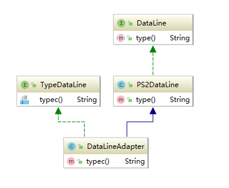

## 适配器模式
说明：  适配器模式一般是用户需要将原来的接口转换成另一个接口，并且原来的接口一样运行,适配器模式让那些接口不兼容的类可以一起工作
 现实的场景：充电器的插头，数据线转换头

适用的场景：
    1. 已经存在的类，他的方法和需求不匹配（方法结果相似或相同)的情况
    2. 适配器模式不是在产品设计的时候提出来的，是随着软件的维护，由于产品的不同，厂家的不同造成功能类似而接口不相同情况下的解决方案。
    
项目案例： 
    1. 当我手上有一个ps2的数据线和一个typec的充电头的时候，那么我需要一个适配器，来转换ps2的头为typc的（类适配器）
    
    2. 案例1的第二种实现（对象适配器，类似于静态代理)
    
    