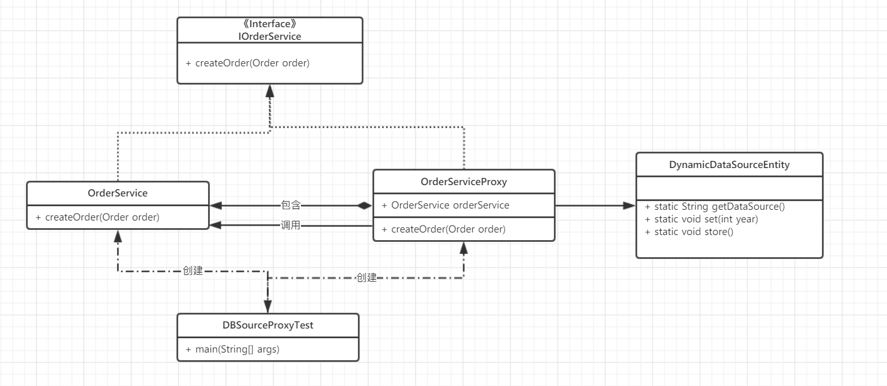

##应用场景：
    1. 事务代理
    2. 非侵入式的日志监听
    3. 动态切换数据源
    4. 中介
    5. 婚介所
    
## 目的：
    1.增强目标对象功能
    2.保护目标对象

## 静态代理 
需要手动完成代理操作，如果被代理类添加新方法，那么代理类也需要添加方法，违背了开闭原则

### 案例 ：
    在分库分表的业务下，需要动态切换数据库
    1.每一年创建的订单放到一个库中

## 动态代理
在运行时进行动态生产代码，遵循了开闭原则
### jdk：
    实现原理：
        要代理的类必须要有接口，然后实现接口的方法。
        直接写Class字节码，生产代理类的效率会高
    使用方式：  
        使用简单（传入classLoad，接口，回调的对象），但是执行方法的时候需要反射获得。
    效率：
        因为执行方法使用反射，所以调用效率会很低
    
### cglib
    实现原理：
        使用的是新建一个类继承需要代理的类，重写需要代理的方法(所以这里不能代理final方法)
        还会生成一个FastClass的类，里面包含了所以的逻辑方法。
        使用ASM框架写Class字节码，生成代理类效率低
    使用方式：
        使用步骤略多，需要创建`Enhancer`，传入代理的类和回调的对象
        由于生成了一个FastClass的类,所以调用不需要通过反射。直接强转成需要代理的类，调用方法即可。
    效率：
        由于不需要反射，所以调用效率大大提高。
        
### sring aop的使用
    实现原理：
        spring会根据要代理的类判断是否有接口，有接口就用jdk的代理模式，没有接口就是要cglib的代理模式
        可以通过配置文件全部使用cglib的代理模式

## 问题?
为什么JDK动态代理中要求目标类实现的接口数量不能超过65535个？

查了jdk的文档后了解：
~~~
The resulting proxy class must not exceed any limits imposed on classes by the virtual machine. For example, the VM may limit the number of interfaces that a class may implement to 65535; in that case, the size of the interfaces array must not exceed 65535.
~~~
翻译：
生成的代理类不能超过虚拟机对类强加的任何限制，VM允许类可以实现接口的数量最大是65535个.

又查找资料了解到：
+ 由于java使用UNICODE(UCS-2)标准字符集，为16位，因此一共能表示2的16次方个字符，即65535个

+ 类或接口的直接超接口的数量被ClassFile结构的interfaces_count项的大小限制为65535。

+ Class文件中方法、字段等都需要引用CONSTANT_UTF8_info型常量来描述名称，所以CONSTANT_UTF8_info型常量的最大长度也就是Java中方法和字段名的最大长度。最大值length是65535，所以Java程序中如果定义了超过64KB英文字符的变量或方法名，将会无法编译。

+ 在java中：Java类或接口最多可以有65,535种方法。Java中构造函数的代码限制为65,535字节