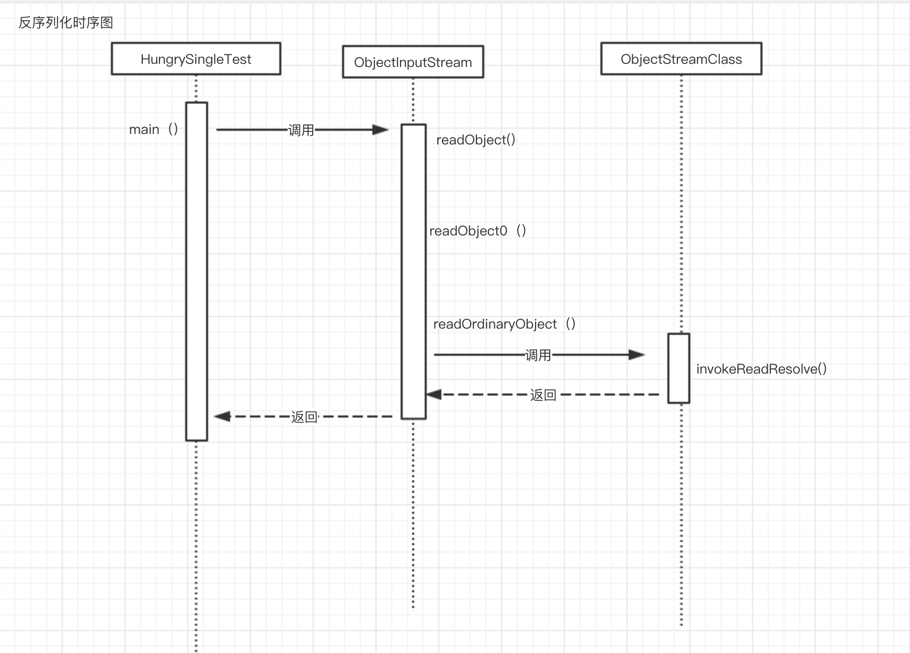
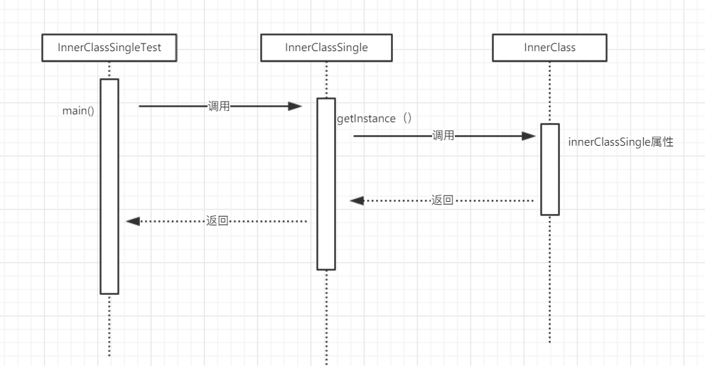

#  单例模式
优点:在内存中只存在一个实例，资源消耗少，
## 恶汉式单例
> 优点：线程安全。
> 缺点：因为是用不用都会创建对象，所以消耗资源
    
## 懒汉式单例
> 优点：因为使用了懒加载，所以消耗资源不是很多。
> 缺点：本身是线程不安全的，所以需要加上synchronized,所以，导致等待锁的状态，导致用时很久
## 懒汉式+双重锁
> 优点: 主要解决了懒汉式单例的（加上synchronized）耗时久的问题。
> 缺点: 
## 懒汉式+内部类(恶汉式)
> 优点 ：因为使用类内部类，所以当没有被使用的时候，是不会加载的。而且没有线程安全的问题。
> 缺点：
## 枚举
> 优点: 天然的线程安全。防止反序列化(jdk禁止enum序列化)。jdk也禁止反射enum（Cannot reflectively create enum objects）
> 缺点：
## threadLocal
>优点：在当前线程中是线程安全的，使用案例是动态数据源
>缺点：

## 思考破坏单例模式的方式有哪些？
+ 反射
+ 反序列化

