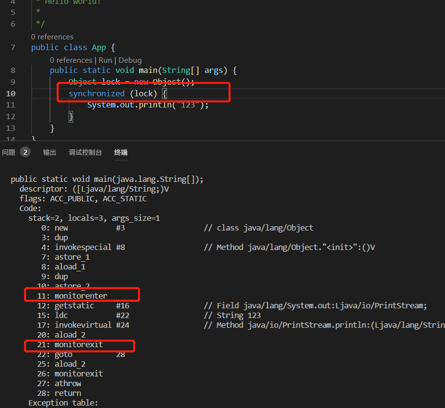
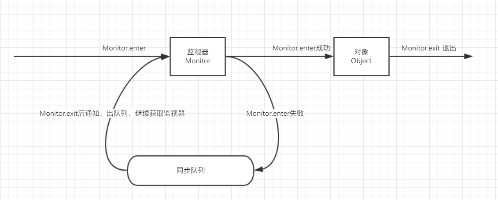

synchronized的使用

+ 修饰实例方法

  ```java
  public synchronized void test1() {
      System.out.println(Thread.currentThread().getName() + " 获取到锁");
  }
  ```

+ 修饰静态方法

  ```java
  public static synchronized void test2(){
      System.out.println(Thread.currentThread().getName() + " 获取到锁");
  }
  ```

+ 修饰代码块

  ```java
  private Object lock = new Object();
  
  public void test3(){
  
      synchronized(lock){
          System.out.println("加锁");
      }
  
  }
  ```


锁是如何存储的? 

在Hotspot虚拟机中，对象在内存中的存储布局，分为3个区域：对象头(Header)，实例数据(instance Data),对象填充(padding)

Mark Word 存储 记录了对象和锁有关的信息

Mark Word 在32位虚拟机的长度是32bit、在64位虚拟机的长度是64bit。 

Mark Word 里面存储的数据会随着锁标志位的变化而变化，所以分为下面5种情况 

| 锁状态   | 25bit                |          | 4bit     | 1bit           | 2bit         |
| -------- | -------------------- | -------- | -------- | -------------- | ------------ |
|          | **23bit**            | **2bit** |          | **是否偏向锁** | **锁标志位** |
| 无锁     | 对象的hashCode       |          | 分代年龄 | 0              | 01           |
| 偏向锁   | 线程ID               | Epoch    | 分代年龄 | 1              | 01           |
| 轻量级锁 | 指向栈中锁记录的指针 |          |          |                | 00           |
| 重量级锁 | 指向重量级锁的指针   |          |          |                | 10           |
| GC标记   | 空                   |          |          |                | 11           |


每个对象都派生自Object对象，每个java Object在JVM中都有一个native的C++对象oop/oopDesc进行对应。

线程在获取锁的时候，其实就是获取一个monitor监视器，monitor可以认为是一个同步对象，所有的java对象都携带monitor。

多个线程去访问同步代码块的时候，其实就去在去争抢monitor监视器修改对象上的锁标识。


但是使用 synchronized 加锁的时候，性能就降低了。 但是不使用的话，就降低了线程的安全性。

这样就出现了无锁。。。


锁的状态会根据竞争的程度发生不同的状态


+ 锁的4种状态

  + 无锁 

  + 偏向锁  

    > 1. 获取锁对象的Mark Word,判断是否处于可偏向的状态。(biased_lock1,且ThreadId为空)
    >
    > 2. 如果是可偏向状态，则通过CAS操作，把当前的线程的ID写入到Mark Word
    >
    > ​	a) 如果cas成功，说明获取到偏向锁了。接着指向同步代码块 
    >
    > ​        b) 如果cas失败，说明有其他的线程已经获取到偏向锁了，这种情况说明当前锁存在竞争，需要撤销已获得偏向锁的线程，并且把它持有的锁升级为轻量级锁（这个操作需要等到全局安全点，也就是没有线程在执行字节码)才执行 
    >
    > 3. 如果是已偏向状态，需要检查mark Word中存储的ThredId是否相当于当前线程的ThreadId
    >
    >    a) 如果相同，不需要再次获得锁，可直接执行同步代码块
    >
    >    b) 如果不相同，说明当前锁偏向于其他线程，需要撤销偏向锁并升级为轻量级锁
    >
    > 

  + 轻量级锁 (自旋锁) 

    就是当另外一个线程在竞争锁的时候，这个线程会在原地等待，而不是把该线程给阻塞，知道那个获得锁的线程把锁释放掉，这个线程就可以马上或得到锁。**注意**：锁在原地循环的时候，是会消耗cpu的，相当于在执行一个啥也没有的for循环。

    所有，轻量级锁适用于那些同步代码块执行很快的场景，这样，线程原地等待很短的时间就能或得到锁。

    但是自旋锁必须要有一定的条件控制，否在如果一个线程执行同步代码块时间很长，那么这个线程不断地循环会消耗CPU的资源，默认情况下，自旋锁的自旋次数是10次。

    在jdk1.6之后，自旋锁加了一个自适应自旋锁，意味着自选的次数是不固定的。根据上一次在同一个锁上自旋的时间以及锁的拥有者的状态来决定。

    如果在同一个锁对象上，自旋等待刚刚成功或得到锁，并且持有锁的线程正在运行中，那么虚拟机就会认为这次自旋也是很有可能成功的，进而他允许自旋等待的次数长一些。对于某个锁，自旋很少成功过的，那么以后尝试获得这个锁时将可能省略掉自旋的过程，直接阻塞线程，避免浪费资源

    轻量级锁的释放

    ​	轻量级锁的释放逻辑就是获得锁的逆向逻辑，通过CAS操作把线程栈帧中的LockRecord替换回锁对象的MarkWord中，如果成功则表示没有竞争，如果失败，则表示当前锁存在竞争，那么轻量级锁就会膨胀为重量级锁

  + 重量级锁 

    `synchronized`   

    

    通过javap 看到被synchronized修饰的对象，都会与一个监控器Monitor关联，相当于一把锁，当一个线程想要执行一段被synchronized修饰的同步方法或者代码块时，该线程得先获得synchronized修饰对象的对应的monitor.

    monitor依赖操作系统的互斥锁来实现的，线程被阻塞后便进入内核(linux) 调度状态，这个会导致系统在用户与内核态直接来回切换，严重影响锁的性能

    

  任意线程对Object对象的访问，首先要获得Object的监视器，如果获得成功的话，就执行同步代码块，然后进行释放监视器，并且唤醒在同步队列中的线程，重新尝试对监视器的获取

  如果获得失败的话，那么就会进入到同步队列中，线程的状态变为Blocked 


wait/notify/notifyAll

wait 表示持有对象锁的线程A准备释放锁的权限，释放cpu的资源并进入到等待的状态

notify 表示持有对象锁的线程A准备释放对象锁权限，通知JVM唤醒某个竞争该对象锁的线程X。线程A synchronized代码执行结束后并且释放了锁之后，线程X直接或得到对象权锁权限，其他竞争线程继续等待。

notifyAll notifyAll 和notify的区别在于，notifyall唤醒所以竞争同一个对象锁的所以线程，当已经获取到锁的线程A释放锁之后，所有被唤醒的线程都有可能获取到对象锁的权限


锁的竞争关系的不同变化


偏向锁

首先获取锁对象的mark word，判断是否处于可偏向状态，(biased_lock=1,且threadId为空)

如果是可偏向状态，通过CAS去保存ThreadId，如果替换成功，就把mark word 中的线程ID指向自己。 执行同步块，暂停线程，然后把mark Word的threadID给清除掉，恢复线程 ，如果没有成功的话，需要撤销获得偏向锁的线程，并且把它持有的锁升级为轻量级锁（这个操作需要等到全局安全点，也就是没有线程在执行字节码）才能执行

如果是已偏向状态，需要检查Mark word中存储的ThreadId是否等于当前线程的ThreadID,如果相同，不需要获得偏向锁，直接执行同步代码块，如果不相同，说明当前偏向锁指向别的线程，需要撤销偏向锁并升级为轻量级锁。

偏向锁的撤销

偏向锁的撤销，并不是把锁恢复到无锁可偏向的状态（偏向锁并不存在锁释放的概念），而是在获得偏向锁的过程中，发现cas失败也就是存在线程竞争时，直接把被偏向的锁对象升级到被加了轻量级锁的状态。

对原持有偏向锁对象的线程进行撤销时，原获得偏向锁的线程有2种情况

​	原获得偏向锁的线程如果已经退出了临界区，也就是执行完毕了，那么这个时候会把对象头设置成无锁状态并且争抢锁的线程可以基于CAS重新偏向当前线程。

​	原获得偏向锁的线程如果还在执行中，处于临界区之内，这个时候会把原获得偏向锁的线程升级为轻量级锁后继续执行同步代码块。


轻量级锁 （自旋锁）

自旋就是，当有另外一个线程来竞争锁时，这个线程会原地等待，而不是把该线程堵塞，知道那个获得锁的线程释放后，这个线程可以马上获得锁，所以说，锁在原地循环的时候，会消耗cpu的。

所以，轻量级锁使用那那种执行很快的场景，

默认是10次。 在1.6版本后，出现了自使用的自旋锁，他会根据上一次该线程执行的时间，进行自动扩展等待次数。


重量级锁（synchronized）

就是通过Monitor.enter 和montor.exit进行加锁和解锁。


